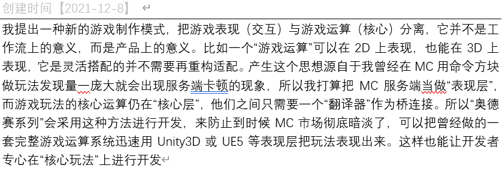
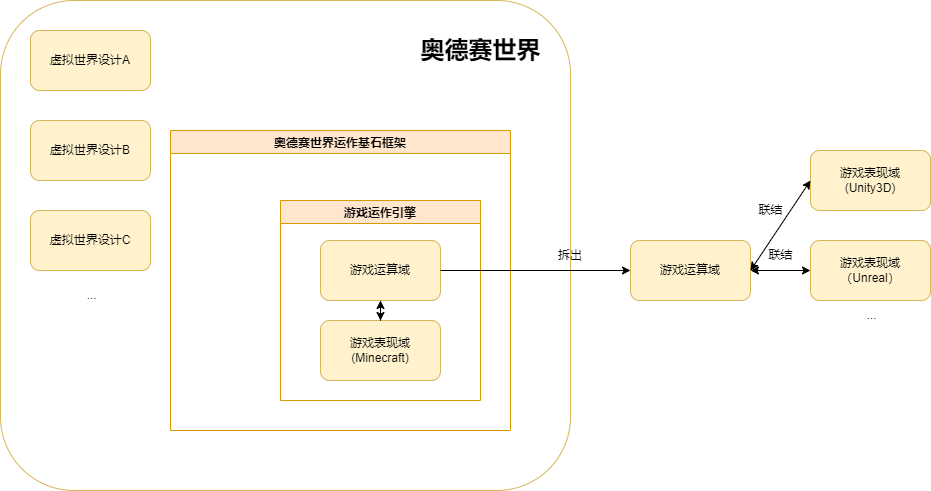

# OdysseyWorld - Minecraft Metaverse

目前**Minecraft**服务端底层的轮子已经非常丰富了，但大家的开发关注点仍在轮子上，缺乏人去做精致的上层建筑，因此`奥德赛世界`应运而生。还是要感谢**Minecraft**服务端底层轮子的所有开发者以及不断蓬勃发展的**Minecraft**社区，没有他们的努力及贡献和最好的环境氛围，不可能形成搭建上层建筑的经济基础条件

`奥德赛世界`是基于`web3.0`思想使用**Minecraft**作为交互表现形式来探索**元宇宙**中**虚拟世界**组织模型的实验

> 这个项目正在开发中：相关模型构建ing  & 相关代码架构ing

## 📕开发目标

该仓库核心开发任务是以“**UGC和AIGC不断创生内容**”这一特点为理念构建框架，属于前面提到的上层建筑中的底层轮子（消除歧义：非经济基础底层轮子），即也是`奥德赛世界`的生态基石
> ”社区蕴含无限潜能，交由社区驱动”      ——leoweyr

该框架里含有一个`游戏运作引擎`（消除歧义：非`游戏开发引擎`），该引擎采用原创思想“**游戏运算与游戏表现分离**”进行设计架构

在该框架中该引擎作用解释为提供给使用**Minecraft**作为游戏开发引擎做出的游戏作为运作框架，引导游戏开发者的工作回到专注于游戏开发的本质——玩法机制设计上去，让表现技术底层问题交由社区更专业的人去做

> 该原创思想实质的起意
>  
> ——leoweyr
>
> 备注："奥德赛系列"指使用Minecraft作为“游戏开发引擎”做出的拥有完整游戏设定和玩法的作品

如果你还没完全理解上方提到的各个要素之间的关系，可以通过下方的奥德赛世界生态关系表述图进行理解

值得注意的是该框架模型本身不为Minecraft设计，只是把Minecraft暂时作为“游戏表现域”进行`虚拟世界`组织模型的实验，随着科技发展会逐步打造成一个真正“元宇宙”中的“虚拟世界”（概念立场：元宇宙≠虚拟世界，虚拟世界是元宇宙的子集）。游戏运作引擎与Minecraft在本质上完全无关，意在打造一个适用于任何游戏开发引擎的运作框架，只需把核心的“游戏运算域”与为对应游戏开发引擎定制的“游戏表现域”联结即可形成完整游戏作品。在本项目中，我们将Minecraft视为一个游戏开发引擎

> ”游戏开发引擎确实可以把’游戏运算域‘与’游戏表现域‘结合，而这里提到的游戏开发引擎专门只做游戏表现的开发工作，’游戏运算域‘可以使用任何方式进行设计与开发，只要符合游戏运作引擎的工作逻辑即可（概念立场：游戏开发引擎并不完全是类似Unity3D或Unreal那样的实体软件，也包括能够进行游戏开发的工作流模式）“      ——leoweyr

## 📞 关于我们

奥德赛世界 QQ交流群：984634765 [点击加入](https://jq.qq.com/?_wv=1027&k=hLyp068y) 

创新折腾 & 技术讨论 QQ交流群：975252105 [点击加入](https://jq.qq.com/?_wv=1027&k=7n1ZUTWL) 
