# OdysseyWorld - UnrealWorld Container

**`奥德赛世界`是基于`web3.0`思想设计架构来探索`元宇宙`中`虚拟感观世界`组织模型的实验**

**（概念立场：元宇宙≠虚拟感观世界，虚拟感观世界是元宇宙的子集）**

>“某些`电子游戏形`产品以`避开电子游戏、不是电子游戏`为借口做出**低质量水平**。元宇宙中虚拟感观世界**离不开游戏设计**，而`百度希壤`纯属蹭元宇宙热度做出来一个垃圾体验产品，故必须**以高水平的游戏设计为基础**。随着时代发展，`电子游戏`的名称也要进行升级，以免**逐渐狭义化跟不上时代的定义和引起刻板印象的偏见**。`虚拟感观世界`是电子游戏的**继承和发展**，相比传统电子游戏注重`体验`不同更在于`参与`，它能够像人工智能深度学习**自我完善**那样不断创生内容丰富扩大”      ——leoweyr

这个项目正在开发中：相关模型构建ing  & 相关代码架构ing。

> 如果你不能体会该项目的理念和思想，请勿将你的刻板印象和偏见强加给本项目

## 🎨

个人可以创造私人虚拟世界（规则、资源、环境由私人所有），与他人分享自己的虚拟世界而形成虚拟世界链，构建去中心化的虚拟世界网络。不同的虚拟世界能相互影响，相互，没有独立隔阂

## 对象关系

`奥德赛世界`单位运行模式是世界承载容器<=>世界连接通道

## 特点

#### 内发自主创生

#### 直接现实影响

#### 运算表现分离

该框架里含有一个`游戏运作引擎`**（消除歧义：非游戏开发引擎）**，该引擎采用原创思想`游戏运算与游戏表现分离`进行设计架构

**在该框架中**该引擎作用解释为提供给使用`Minecraft`作为`游戏开发引擎`做出的游戏作为**运作框架**，引导游戏开发者的工作回到**专注于游戏开发的本质——玩法机制设计**上去，让表现技术底层问题交由社区**更专业**的人去做

> 该原创思想实质的起意
>  
> ——leoweyr
>
> 备注：`奥德赛系列`指使用Minecraft作为游戏开发引擎做出的拥有**完整游戏设定和玩法**的作品

如果你还没完全理解上方提到的各个要素之间的关系，可以通过下方的**奥德赛世界生态关系表述图**进行理解

值得注意的是该框架模型**本身不为Minecraft设计**，只是**把Minecraft暂时作为`游戏表现域`进行虚拟感观世界组织模型的实验**，随着科技发展会逐步打造成一个真正元宇宙中的虚拟感观世界。`游戏运作引擎`与Minecraft在**本质上完全无关**，意在打造一个**适用于任何`游戏开发引擎`的运作框架**，只需把核心的`游戏运算域`与为对应游戏开发引擎定制的`游戏表现域`联结即可形成完整游戏作品。**在本项目中，我们将Minecraft视为一个游戏开发引擎**

> “`游戏开发引擎`确实可以把游戏运算域与游戏表现域结合，而这里提到的`游戏开发引擎`**专门只做游戏表现的开发工作**，`游戏运算域`可以**使用任何方式进行设计与开发**，只要符合游戏运作引擎的工作逻辑即可**（概念立场：游戏开发引擎并不完全是类似`Unity3D`或`Unreal`那样的实体软件，也包括能够进行游戏开发的工作流模式）**”      ——leoweyr

## 首个承载的虚拟世界Minecraft World

目前`Minecraft`**服务端底层轮子**已经非常丰富了，但大家的开发关注点**仍在**轮子上，缺乏人去做**精致的上层建筑**，因此`奥德赛世界`应运而生。还是要感谢Minecraft服务端底层轮子的所有开发者以及不断蓬勃发展的Minecraft社区，没有他们的努力及贡献和最好的环境氛围，不可能形成搭建上层建筑的**经济基础条件**

## 📕开发目标

该仓库核心开发任务是以`UGC和AIGC不断创生内容`这一特点为理念构建框架，属于前面提到的**上层建筑中的底层轮子（消除歧义：非经济基础底层轮子）**，即也是`奥德赛世界`的**生态基石**

> “社区蕴含无限潜能，交由社区驱动”      ——leoweyr

## 🔮开发思路

- 由简单实现到高阶巧妙：先用简单的代码层次实现基本需求再逐渐深入加入一些**高阶技术**拓展更加高级的功能并**巧妙化**代码结构
- 分域程序打标签： 为`游戏运算域`或`游戏表现域`不同工作的程序之间要严格**区分**开，`框架型`和`功能型`程序也要严格标明
- 方法代码与执行代码分离：用`类的封装`或`函数原型`的形式写**接口**，在另一代码文件中通过调用**接口**来执行方法

## 💉科研价值

- 可以在**成熟**的虚拟感观世界中建立**更加真实**的`数字孪生`进行**社会模型实验**

- 可以在虚拟感观世界中实践`仿生环境`模型

  > 仿生环境：收集人们实际的数据使虚拟感观世界的人文环境不断完善靠近现实世界的情况

## 📞 关于我们

奥德赛世界 QQ交流群：984634765 [点击加入](https://jq.qq.com/?_wv=1027&k=hLyp068y) 

创新折腾 & 技术讨论 QQ交流群：975252105 [点击加入](https://jq.qq.com/?_wv=1027&k=7n1ZUTWL) 